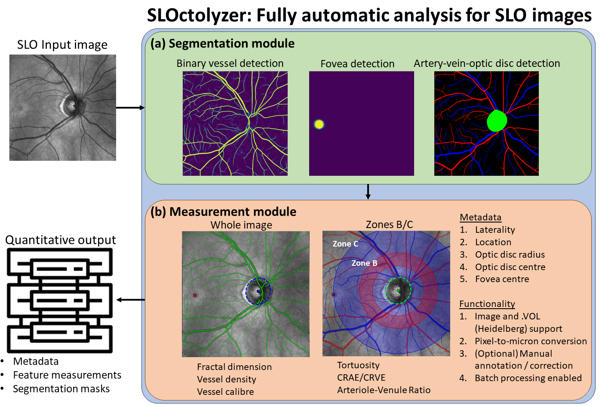

# SLOctolyzer: Analysis toolkit for automatic segmentation and measurement of retinal vessels on SLO images
Analysis toolkit for automatic segmentation and measurement of retinal vessels for confocal, near infra-red scanning laser ophthalmoscopy (SLO) images.

SLOctolyzer is a fully automatic pipeline which is capable of fully characterising the vessels, fovea and optic disc in SLO images. The pipeline utilises fully automatic deep learning methods for segmenting these landmarks, including detection of arteries and veins.

Please find the journal article describing SLOctolyzer's entire pipeline [here](https://tvst.arvojournals.org/article.aspx?articleid=2802220), which was previously published in ARVO's Translational Vision Science and Technology.

SLOctolyzer is also capable of extracting clinically-relevant features of interest of the segmented retinal vessels. The code used to measure retinal vessel features is heavily based on the code produced by [Automorph](https://tvst.arvojournals.org/article.aspx?articleid=2783477), whose codebase can be found [here](https://github.com/rmaphoh/AutoMorph).

See below for a visual description of SLOctolyzer's analysis pipeline.

<p align="center">
  
</p>

---

## Table of contents

- [File structure](#file-structure)
- [Getting started](#getting-started)
    - [Quick start](#quick-start)
- [SLOctolyzer's support](#sloctolyzers-support)
    - [OS compatibility](#os-compatibility)
- [SLOctolyzer's pipeline](#sloctolyzers-pipeline)
    - [Segmentation](#segmentation)
    - [Feature measurement](#feature-measurement)
        - [Regions of interest](#regions-of-interest)
        - [Resolution](#resolution)
        - [SLO centering](#slo-centering)
    - [Execution Time](#execution-time)
- [Fixing segmentation errors](#fixing-segmentation-errors)
- [Debugging](#debugging)
    - [Interactive debugging](#interactive-debugging)
- [Related repositories](#related-repositories)
- [Contributors and citing](#contributors-and-citing)
- [Updates](#updates)

  

---

### File structure

```
.
├── analyze/		# Example data
├── figures/		# Figures for README
├── instructions/	# Instructions, installation, manual annotation help
├── sloctolyzer/	# core module for carrying out segmentation and feature measurement
├── config.txt		# Text file to specify input/output directories, and whether to robustly analyse a batch, i.e. ignore unexpected errors and bugs.
├── README.md		# This file
└── usage.ipynb		# Demonstrative Jupyter notebook to see usage.
```

- The code found in `sloctolyzer`
```
.
├── sloctolyzer/                             
├───── measure/		# Feature extraction
├───── segment/		# Segmentation inference modules.
├───── __init__.py
├───── analyse.py	# Script to segment and measure a single SLO image and save out results. Can be used interactively via VSCode or Notebooks.
├───── main.py		# Wrapper script to run SLOctolyzer from the terminal for batch processing.
└───── utils.py		# Utility functions for plotting and processing segmentations.
```

---

## Getting started

To get a local copy up follow the steps in `instructions/quick_start.txt`, or follow the instructions below.

1. You will need a local installation of Python to run SLOctolyzer. We recommend a lightweight package management system such as Miniconda. Follow the instructions [here](https://docs.anaconda.com/free/miniconda/miniconda-install/) to download Miniconda for your desired operating system.

2. After downloading, navigate and open the Anaconda Prompt and clone the SLOctolyzer repository.

```
git clone https://github.com/jaburke166/SLOctolyzer.git
```

3. Create environment and install dependencies to create your own environment in Miniconda.

```
conda create -n oct-analysis python=3.11 -y
conda activate oct-analysis
pip install -r requirements.txt
```
  
Done! You have successfully set up the software to analyse SLO image data!

Now you can:

1. Launch notebooks using `jupyter notebook` or jupyter labs using `jupyter lab` and see the minimal example below so that you can analyse your own SLO data.

2. Alternatively, edit the `image_directory` and `output_directory` options in `config.txt` and run `python path\to\SLOctolyzer/sloctolyzer/main.py` to batch process your own dataset.


If you have any problems using this method, please do not hesitate to contact us - see the end of this README for contact details!

### Quick start

Please refer to `usage.ipynb` for an interactive demonstration of analysing SLO data. The first cell is copied below as the minimal example which loads in the demonstrative data found in `analyze/images` and processes any detected image files of `.png` and `.tif` type.

```
# load necessary modules
from sloctolyzer import analyse
from pathlib import Path

# Detect images in analyze/images
paths = []
for type in [".png", ".tif"]:
    paths += list(Path("analyze/demo").glob(f"*{type}"))

# Specify path to image, a save_path and scale/location/eye if know. Here, we do not specify
path = paths[0]
save_path = "analyze/output"
scale = None # for (768,768) images this is typically 11.48 for an emmetropic eye
location = None # Can be either "Macula" or "Optic disc" (speech marks inclusive)
eye = None # Can be either "Left" or "Right" (speech marks inclusive)

# Analyse SLO image - saved out in analyze/output/ into a folder whose name is the filename of the image
output = analyse.analyse(path, save_path, scale, location, eye, save_images=1, save_results=1)
# output is a tuple containing metadata as a dataframe, feature measurements as a list of dataframes
# the SLO image, all three segmentation masks and a list of strings for the purposes of logging
```

---

## SLOctolyzer's support

At present, SLOctolyzer is vendor neutral and supports most image file formats (with case invariant types `tif/tiff/png/jpeg/jpg/bmp`). If you are working with imaging devices from Heidelberg Engineering, you may have a RAW export license and thus can extract data with the `.vol` file format. SLOctolyzer also supports this file format. `.vol` is helpful for providing essential metadata and image data in one file, permitting feature measurements to be converted from pixel space to physical space.

Briefly, SLOctolyzer can be run from the terminal using `main.py` for analysing batches of images, or using `analyse.py` individually per image file using your favourite, interactive IDE such as [VSCode](https://code.visualstudio.com/download) or [Jupyter Notebooks](https://jupyter.org/). In the latter, we expect paths (as strings) to images, rather than the pixel arrays as input.

When using the terminal, you can specify certain input parameters using a configuration file, `config.txt`. Here, you can specify the `image_directory` as where your SLO images are stored and `output_directory` as where the results will be saved to.


### OS Compatibility

At present, SLOctolyzer is compatible with Windows and macOS operating systems. Given the compatibility with macOS, it's likely that Linux distributions will also work as expected, although this has not been tested explicitly. The installation instructions are also the same across operating systems (once you have installed the relevant Miniconda Python distributions for your own operating system). 

Once SLOctolyzer is downloaded/cloned and the conda environment/python packages have been installed using the commands in `instructions/install.txt`, it is only the file path structures to be aware of when switching between OS, i.e. in the configuration file, `config.txt`, the `image_directory` and `output_directory` should be compatible with your OS.

---

## SLOctolyzer's pipeline

### Segmentation

For segmentation, we use three separate deep learning-based models. One for binary vessel segmentation of the en face retinal vessels, and another for segmentation of the en face retinal vessels into arteries and veins, and simultaneous detection of the optic disc. A final, third model only detects on the fovea on the en face SLO image. Please see the [paper](https://tvst.arvojournals.org/article.aspx?articleid=2802220) which describes these models in more detail, including which datasets and training strategies were used for each model.

### Feature measurement

At present, the features measured on the SLO image across the whole image are:
- Fractal dimension (dimensionless)
- Vessel perfusion density (dimensionless)
- Global vessel calibre (computed globally in microns or pixels, dependent on whether a conversion factor is specified, see below)

Additionally, for smaller regions of interest, zones B and C, and the whole image, the following measurements will be measured in pixels or microns, dependent on whether the conversion factor is specified (see below):
- Tortuosity density
- Local vessel calibre (similar to average vessel width, but computed and averaged across individual vessel segments)
- CRAE (for detected arteries only) using Knudston's formula
- CRVE (for detected veins only) using Knudston's formula
- arteriolar–venular ratio (AVR), which is CRAE divided by CRVE.

**A note on tortuosity**: A current limitation of the pipeline surrounds artery and vein map disconnectedness. Artery-vein crossings on the SLO are segmented such that only artery OR vein is classified, not both. This was an oversight at the point of ground truth annotation before model training. Thus, the individual artery/vein maps are disconnected. Unfortunately, this may have an impact on tortuosity density measurements.


#### Regions of interest

At present, macula-centred SLO images have only one region of interest (ROI) which is the whole image.

For optic disc-centred SLO images there are three ROI's used for feature measurement. In the description below, D is the diameter of the optic disc.
- Zone B: This is an annulus ROI centred at the optic disc, which measures between 0.5D and 1D from the disc margin (0.5D - 1D). 
- Zone C: This is an annulus ROI centred at the optic disc, which measures from the disc margin to two diameters of the disc away (0 - 2D).
- The whole image.


#### Resolution

OCT imaging devices which produce SLO image data provide an exact conversion factor between pixel space and physical space. This can be helpful to convert measurements from pixels into microns (or mm). For Heidelberg Engineering data, each distinct acquisition has their own conversion factor depending on the cllibration of the device during examination (scan focus setting, corneal cuvrature, etc.)

Features such as `average_vessel_width`, `vessel_calibre`, `CRAE` and `CRVE` are measured in pixels and thus can be converted into microns if the conversion factor is known. 

In `analyze` there is an excel document `fname_resolution_location_eye.xlsx` where you can store the filenames of the images planned for analysis in the `Filename` column, and their corresponding conversion factor, or scale, measured in `microns per pixel` in the `Scale` columns. You can also include information on the eye type in the `Eye` column ("Right" or "Left"), and the location of the scan ('Macula'- or 'Optic disc'-centred) using the `Location` column.

If you do not care or have access to the conversion factor for any image, you can leave the `Scale` cell blank. Similarly for cells in the `Location` and `Eye` columns if this information is not known. 

In fact, you can ignore the document entirely and SLOctolyzer will still run, and will by default only output pixel-unit measurements, and try infer the eye type and location based on the detected locations of the optic disc centre and fovea. Sanity checking the eye and location classification is recommended by inspecting the "segmentations" directory in the output folder after running the software.


#### SLO centering

-SLO images are typically either centred at the fovea or centred at the optic disc. There are standard regions of interest defined to analyse these different types of scans (see above). You can use the excel document `fname_resolution_location_eye.xlsx` found in `analyze` to specify the location of each image (in the `Location` columns). This is not compulsory, as the pipeline does support automatic detection of the location of the SLO scan if the location is not provided by the user. However, it remains to be seen how robust this detection is, users be aware! This goes the same for detecting the eye type (Right or Left).

### Execution time

SLOctolyzer can run reasonably fast using a standard, GPU-less Windows laptop CPU. Even without GPU accelerations, the segmentation inference of all three models only takes around ~11 seconds. Nevertheless, SLOctolyzer is equipped to detect if there is a GPU available (CUDA only, not MPS for macOS currently) to accelerate segmentation inference.

Feature measurement is longer than segmentation inference because:
- Measurements are made for the binary vessel, artery and vein segmentation maps.
- For optic disc-centred SLO images, there are three regions of interest considered making it longer to measure than macula-centred images.
- Image resolution plays a role too, where (768,768) image resolution is quicker than (1536,1536) resolution.

However, based on the example images in `analyze/demo`, a standard laptop Windows CPU takes
- ~15 seconds for an macula-centred SLO image at (768,768) resolution.
- ~30 seconds for an optic disc-centred SLO image at (768,768) resolution.
- ~100 seconds for an optic disc-centred SLO image at (1536,1536) resolution.

The execution time here may vary dependent on the size of the CPU, and whether GPU acceleration is utilised for segmentation inference, so only act as a rough guide.


---

## Fixing segmentation errors

We do not have any automatic functionality within SLOctolyzer to correct any vessel segmentation errors. Thus, we rely on the user to identify any visible problems with vessel classification.

However, we do provide functionality to correct retinal vessel and optic disc segmentation via ITK-Snap. There are instructions on using ITK-Snap for manual annotations in `instructions/manual_annotations` which describe how to se tup ITK-Snap and use it to correct the binary vessel mask, and also the artery-vein-optic disc segmentation masks. 

Once the corrected segmentations are saved out as `.nii.gz` files in the same folder with the original `.png` segmentation mask(s), the pipeline can be run again and SLOctolyzer should automatically identify these additional manual annotations and re-compute the features!

---

## Debugging

If you have any issues with running this toolkit on your own device, please contact us (see end of README for contact email). 

This project and software package is an evolving toolkit, so we are expecting unexpected errors to crop up on use-cases which the developers have not foreseen. We hope this pipeline will continue to be adapted to the needs of the end-user, so we welcome any and all feedback!

At the moment, setting `robust_run` to 1 will ensure that batch-processing does not fail if an unexpected error is caught. In fact, if an exception is found, details on the error in terms of it's type and full traceback are saved out in the process log (as well as printed out on the terminal/IDE) so the end-user may interrogate the codebase further and understand the source of the error.

### Interactive debugging

In the jupyter notebook `debugger.ipynb`, this contains the code in `sloctolyzer/analyse.py` step-by-step (or, cell-by-cell) which defines SLOctolyzer's analysis pipeline for an SLO input. 

For an SLO file which fails to be analysed, an end-user with minimal experience in Python should be able to try run this notebook and understand at what point of the pipeline the software fails. This is particularly helpful for raising Issues on the Github repository so that a developer can better understand the problem.

---

## Related repositories

If you are interested in OCT (and SLO) image analysis, check this repoistory out:

* [OCTolyzer](https://github.com/jaburke166/OCTolyzer): A fully automatic analysis toolkit for segmentation and feature extracting in OCT and SLO data.

If you are interested in automatic choroid analysis in OCT B-scans specifically, check these repositories out:

* [Choroidalyzer](https://github.com/justinengelmann/Choroidalyzer): A fully automatic, deep learning-based toolkit for choroid region and vessel segmentation, and fovea detection in OCT B-scans.
* [DeepGPET](https://github.com/jaburke166/deepgpet): fully automated choroid region segmentation in OCT B-scans.
* [MMCQ](https://github.com/jaburke166/mmcq): A semi-automatic algorithm for choroid vessel segmentation in OCT B-scans based on multi-scale quantisation, histogram equalisation and pixel clustering.

If you are interested in colour fundus photography (CFP) image analysis, check this repository out:

* [Automorph](https://github.com/rmaphoh/AutoMorph): Automated retinal vascular morphology quantification via a deep learning pipeline.

---

## Contributors and Citing

The contributors to this method and codebase are:

* Jamie Burke (Jamie.Burke@ed.ac.uk)

If you wish to use this toolkit please consider citing our work using the following BibText

```
article{burke2024sloctolyzer,
  title={SLOctolyzer: Fully automatic analysis toolkit for segmentation and feature extracting in scanning laser ophthalmoscopy images},
  author={Burke, Jamie and Gibbon, Samuel and Engelmann, Justin and Threlfall, Adam and Giarratano, Ylenia and Hamid, Charlene and King, Stuart and MacCormick, Ian JC and MacGillivray, Thomas J},
  journal={Translational Vision Science \& Technology},
  volume={13},
  number={11},
  pages={7--7},
  year={2024},
  publisher={The Association for Research in Vision and Ophthalmology}
}
  ```

---

## Updates

### 14/02/2025

* Updated `README.md` structure and included a table of contents.

* Added debugging jupyter notebook `debugger.ipynb` for end-users with minimal experience in Python to better understand why an SLO image file might have failed during processing.

### 11/02/2025

* Included a `requirements.txt` file to ensure proper installation of dependencies with SLOctolyzer's pipeline.

